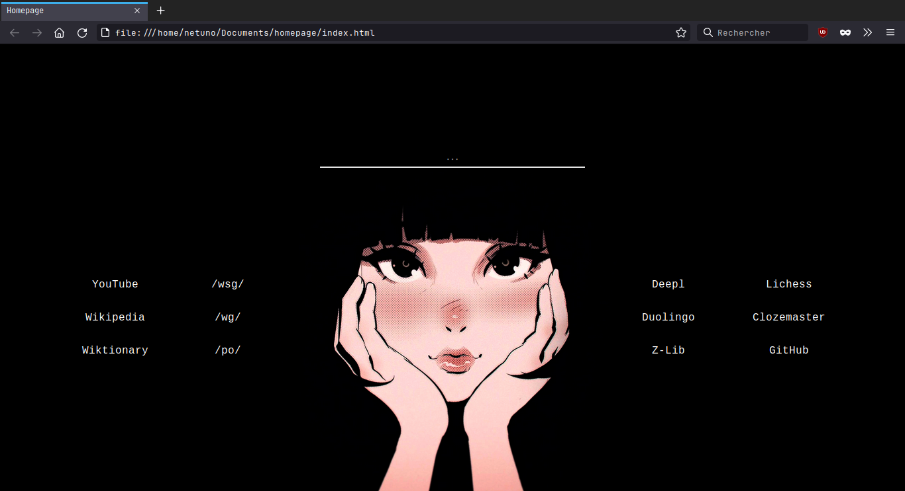
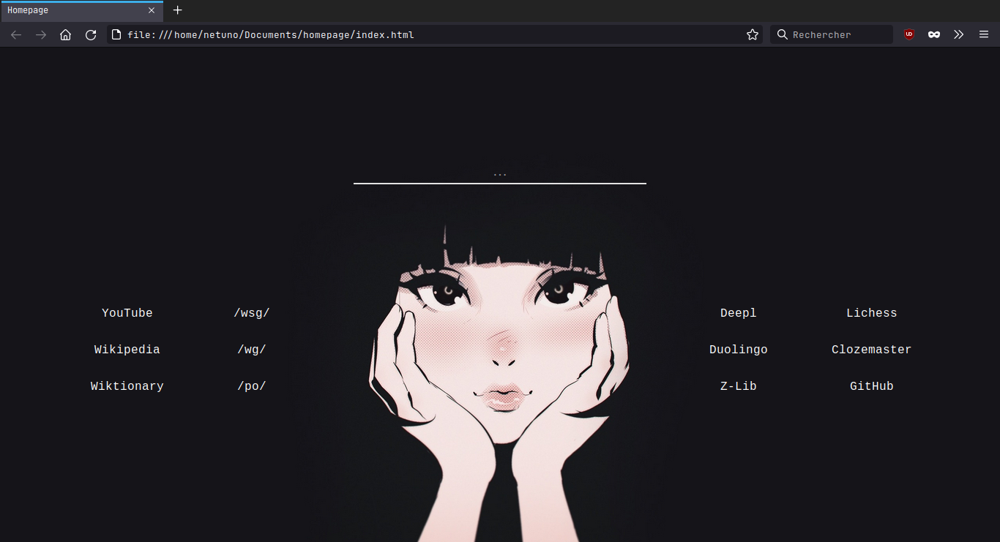

### A simple homepage/startpage

I made this to cluster links and a search bar in one place whilst being aesthetic beautiful - at least, in my opinion.

Keep in mind that I made it without prior html/css knowledge, learning while making it. Sorry for any mistakes or redundancies in my code.

I had some other ideas in mind to it. For instance, display greetings in different languages that I know/am learning in the upper right corner. It would change according to the time of the day. But... it's too much work and involves knowledge that I don't have and won't worth the effort and time for something I won't be doing a lot / work with - in this case, programming.

Anyway, suggestions and/or additions are very welcome!

Abraços e até mais,

*Netuno / Entnuo*

---

### Screenshots

Normal:



Alt:



Credits: these wallpapers where posted in /wg/, I have no idea who is the original artist; credits to them is appreciated and will be linked in here. Thanks Anon for showing me these.

### Setting as the new tab page

*This was tested with Firefox 95. [Credits](https://old.reddit.com/r/firefox/comments/ge86z4/newtab_page_to_local_file_firefox_76_redux/).*

*Remember to use `sudo` when editing the following files.*

Open `/usr/lib/firefox/defaults/pref/local-settings.js` and paste the following:

```
//
pref("general.config.filename", "mozilla.cfg");
pref("general.config.obscure_value", 0);
pref("general.config.sandbox_enabled", false);
```

Now, open `/usr/lib/firefox/mozilla.cfg` and paste the following:

```
//
var {classes:Cc,interfaces:Ci,utils:Cu} = Components;

/* set new tab page */
try {
  Cu.import("resource:///modules/AboutNewTab.jsm");
  var newTabURL = "file:///path/where/you/downloaded/index.html";
  AboutNewTab.newTabURL = newTabURL;
} catch(e){Cu.reportError(e);} // report errors in the Browser Console
```

Restart Firefox, it should be working.
